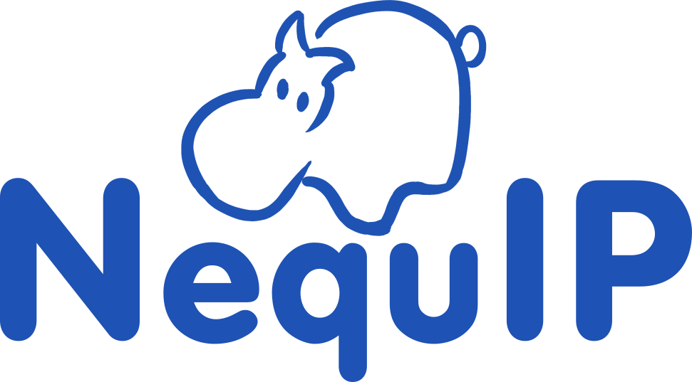

  

 

  

# NequIP

NequIP is an open-source code for building E(3)-equivariant interatomic potentials.
 
 - [Installation and usage](#installation-and-usage)
 - [Tutorial](#tutorial)
 - [References & citing](#references--citing)
 - [Authors](#authors)
 - [Community, contact, questions, and contributing](#community-contact-questions-and-contributing)

> [!IMPORTANT]
> A [major backwards-incompatible update](./docs/guide/upgrading.md) to the `nequip` package was released on April 23rd 2025 as version v0.7.0. The previous version v0.6.2 can still be found for use with existing config files in the GitHub Releases and on PyPI.

## Installation and usage

Installation instructions and user guides can be found in our [docs](https://nequip.readthedocs.io/en/latest/).

## Tutorial 

The best way to learn how to use NequIP is through the [tutorial notebook](https://colab.research.google.com/github/mir-group/nequip-tutorial/blob/main/NequIP_Tutorial.ipynb). This will run entirely on Google Colab's cloud virtual machine; you do not need to install or run anything locally.

## References & citing

**Any and all use of this software, in whole or in part, should clearly acknowledge and link to this repository.**

If you use this code in your academic work, please cite:

 1. The [preprint describing the NequIP software framework](https://arxiv.org/abs/2504.16068):
    > Chuin Wei Tan, Marc L. Descoteaux, Mit Kotak, Gabriel de Miranda Nascimento, Seán R. Kavanagh, Laura Zichi, Menghang Wang, Aadit Saluja, Yizhong R. Hu, Tess Smidt, Anders Johansson, William C. Witt, Boris Kozinsky, Albert Musaelian.  
    > "High-performance training and inference for deep equivariant interatomic potentials."  
    > https://doi.org/10.48550/arXiv.2504.16068

And also consider citing:

 2. The [original NequIP paper](https://www.nature.com/articles/s41467-022-29939-5)
    > Simon Batzner, Albert Musaelian, Lixin Sun, Mario Geiger, Jonathan P. Mailoa, Mordechai Kornbluth, Nicola Molinari, Tess E. Smidt, and Boris Kozinsky.  
    > "E(3)-equivariant graph neural networks for data-efficient and accurate interatomic potentials."  
    > Nature communications 13, no. 1 (2022): 2453

 3. The [computational scaling paper](https://dl.acm.org/doi/abs/10.1145/3581784.3627041) that discusses optimized LAMMPS MD 
    > Albert Musaelian, Anders Johansson, Simon Batzner, and Boris Kozinsky.  
    > "Scaling the leading accuracy of deep equivariant models to biomolecular simulations of realistic size."  
    > In Proceedings of the International Conference for High Performance Computing, Networking, Storage and Analysis, pp. 1-12. 2023.

 4. The `e3nn` equivariant neural network package used by NequIP, through its [preprint](https://arxiv.org/abs/2207.09453) and/or [code](https://github.com/e3nn/e3nn)

**Extension packages like [Allegro](https://github.com/mir-group/allegro) have their own additional relevant citations.**

BibTeX entries for a number of the relevant papers are provided for convenience in [`CITATION.bib`](./CITATION.bib).

## Authors

Please see [`AUTHORS.md`](./AUTHORS.md).

## Community, contact, questions, and contributing

If you find a bug or have a proposal for a feature, please post it in the [Issues](https://github.com/mir-group/nequip/issues).
If you have a self-contained question or other discussion topic, try our [GitHub Discussions](https://github.com/mir-group/nequip/discussions).

Active users and interested developers are invited to join us on the NequIP community chat server, which is hosted on the excellent [Zulip](https://zulip.com/) software.
Zulip is organized a little bit differently than chat software like Slack or Discord that you may be familiar with: please review [their introduction](https://zulip.com/help/introduction-to-topics) before posting.
[Fill out the interest form for the NequIP community here](https://forms.gle/mEuonVCHdsgTtLXy7).

If you want to contribute to the code, please read ["Contributing to NequIP"](docs/dev/contributing.md).

We can also be reached by email at allegro-nequip@g.harvard.edu.
