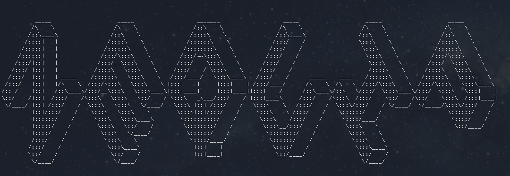

# NequIP

NequIP is an open-source code for building E(3)-equivariant interatomic potentials.




**PLEASE NOTE:** the NequIP code is under active development and is still in beta versions 0.x.x. In general changes to the patch version (the third number) indicate backward compatible beta releases, but please be aware that file formats and APIs may change. Bug reports are also welcomed in the GitHub issues!

## Installation

NequIP requires:

* Python >= 3.6
* PyTorch = 1.8

To install:

* Install [PyTorch Geometric](https://github.com/rusty1s/pytorch_geometric), make sure to install this with your correct version of CUDA/CPU and to use PyTorch Geometric version 1.7.0:

```
pip install torch-scatter -f https://pytorch-geometric.com/whl/torch-1.8.0+${CUDA}.html
pip install torch-sparse -f https://pytorch-geometric.com/whl/torch-1.8.0+${CUDA}.html
pip install torch-cluster -f https://pytorch-geometric.com/whl/torch-1.8.0+${CUDA}.html
pip install torch-spline-conv -f https://pytorch-geometric.com/whl/torch-1.8.0+${CUDA}.html
pip install torch-geometric==1.7.0
pip install e3nn==0.2.9
```

where ```${CUDA}``` should be replaced by either ```cpu```, ```cu101```, ```cu102```, or ```cu111``` depending on your PyTorch installation, for details see [here](https://github.com/rusty1s/pytorch_geometric). 

* Install [e3nn](https://github.com/e3nn/e3nn), version 0.2.9: 

```
pip install e3nn==0.2.9
```

* Install our fork of [`pytorch_ema`](https://github.com/Linux-cpp-lisp/pytorch_ema) for using an Exponential Moving Average on the weights: 
```bash
$ pip install git+https://github.com/Linux-cpp-lisp/pytorch_ema@context_manager#egg=torch_ema
```

* We use [Weights&Biases](https://wandb.ai) to keep track of experiments. This is not a strict requirement, you can use our package without this, but it may make your life easier. If you want to use it, create an account [here](https://wandb.ai) and install it: 

```
pip install wandb
```

* Install NequIP

```
git clone https://github.com/mir-group/nequip.git
cd nequip
pip install . 
```

### Installation Issues

We recommend running the tests using ```pytest``` on a CPU: 

```
pip install pytest
pytest ./tests/
```

## Usage

**! PLEASE NOTE:** the first few training epochs/calls to a NequIP model can be painfully slow. This is expected behaviour as the [profile-guided optimization of TorchScript models](https://program-transformations.github.io/slides/pytorch_neurips.pdf) takes a number of calls to warm up before optimizing the model. This occurs regardless of whether the entire model is compiled because many core components from e3nn are compiled and optimized through TorchScript.

### Basic network training

To train a network, you run `nequip-train` with a YAML config file that describes your data set, model hyperparameters, and training options. 

```bash
$ nequip-train configs/example.yaml
```

A number of example configuration files are provided:
 - [`configs/minimal.yaml`](configs/minimal.yaml): A minimal example of training a toy model on force data.
 - [`configs/minimal_eng.yaml`](configs/minimal_eng.yaml): The same, but for a toy model that predicts and trains on only energy labels.
 - [`configs/example.yaml`](configs/example.yaml): Training a more realistic model on forces and energies.
 - [`configs/full.yaml`](configs/full.yaml): A complete configuration file containing all available options along with documenting comments.

Training runs can be restarted using `nequip-restart`; training that starts fresh or restarts depending on the existance of the working directory can be launched using `nequip-requeue`. All `nequip-*` commands accept the `--help` option to show their call signatures and options.

### In-depth tutorial 

A more in-depth introduction to the internals of NequIP can be found in the [tutorial notebook](https://deepnote.com/project/2412ca93-7ad1-4458-972c-5d5add5a667e).

### LAMMPS Integration 

NequIP is integrated with the popular Molecular Dynamics code [LAMMPS](https://www.lammps.org/) which allows for MD simulations over large time- and length-scales and gives users access to the full suite of LAMMPS features. 

The interface is implemented as `pair_style nequip`. Using it requires two simple steps: 

1. Deploy a trained NequIP model. This step compiles a NequIP model trained in Python to [TorchScript](https://pytorch.org/docs/stable/jit.html). 
The result is an optimized model file that has no Python dependency and can be used by standalone C++ programs such as LAMMPS: 

```
nequip-deploy build path/to/training/session/ path/to/deployed.pth
```

2. Change the LAMMPS input file to the nequip `pair_style` and point it to the deployed NequIP model:

```
pair_style	nequip
pair_coeff	* * deployed.pth
```

For installation instructions, please see the NequIP `pair_style` repo at https://github.com/mir-group/pair_nequip.


## References

The theory behind NequIP is described in our preprint [1]. NequIP's backend builds on e3nn, a general framework for building E(3)-equivariant neural networks [2]. 

    [1] https://arxiv.org/abs/2101.03164
    [2] https://github.com/e3nn/e3nn

## Authors

NequIP is being developed by:

    - Simon Batzner
    - Albert Musaelian
    - Lixin Sun
    - Anders Johansson
    - Mario Geiger
    - Tess Smidt

under the guidance of Boris Kozinsky at Harvard.


## Contact

If you have questions, please don't hesitate to reach out at batzner[at]g[dot]harvard[dot]edu. 


## Citing

If you use this repository in your work, please consider citing NequIP (1) and e3nn (2): 

    [1] https://arxiv.org/abs/2101.03164
    [2] https://doi.org/10.5281/zenodo.3724963
